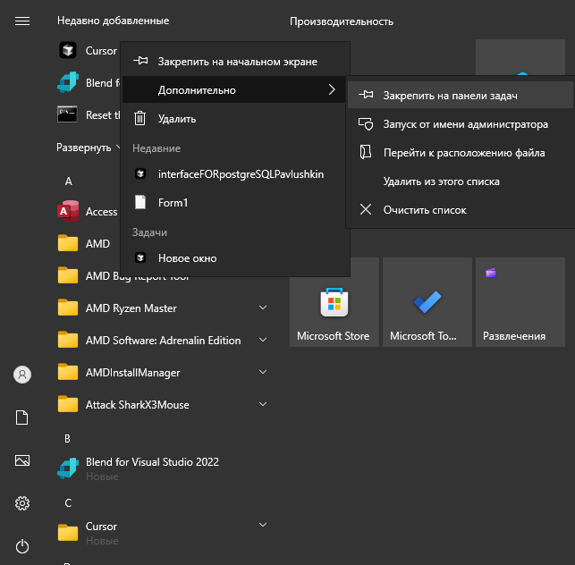

# Лабораторная работа №5: Настройка параметров рабочей среды пользователя в ОС Windows

## Павлушкин Андрей

## Номер, название, цель работы

**Номер:** 5
**Название:** Настройка параметров рабочей среды пользователя в ОС Windows
**Цель:** Научиться выполнять различные настройки параметров рабочей среды пользователя.

## Выполненное задание

### I. Настройка рабочего стола

1. **Выберите фоновый рисунок рабочего стола.**
   - Щелкните правой кнопкой мыши на рабочем столе и выберите "Персонализация".
   - В разделе "Фон" выберите "Рисунок" и выберите изображение из предложенных или загрузите свое.
   ! 

2. **Измените цветовую схему.**
   - В окне "Персонализация" перейдите в раздел "Цвета".
   - Выберите цветовую схему или настройте свои цвета.
   

3. **Настройте оформление окон Windows и их элементов.**
   - В окне "Персонализация" перейдите в раздел "Темы" и выберите "Настройки темы".
   - Настройте оформление окон и элементов по своему вкусу.
   

4. **Подключите и настройте заставку экрана.**
   - В разделе "Экран блокировки" выберите "Параметры заставки".
   - Настройте заставку по своему усмотрению.
   

5. **Сохраните пакет настроек как оформление темы Windows.**
   - В разделе "Темы" выберите "Сохранить тему" и дайте ей имя.
   

6. **Определите сохранение темы пользователя.**
   - Убедитесь, что тема сохранена и применена. [zxc]
   

### II. Настройка звука

1. **Выберите схему звукового оформления.**
   - Щелкните правой кнопкой мыши на значке динамика в панели задач и выберите "Звуки".
   - В разделе "Звуки" выберите схему звукового оформления.
   

2. **Настройте программные события, выбрав подходящие звуки.**
   - В том же окне настройте звуки для различных событий.
   

3. **Сохраните новые настройки как звуковую схему.**
   - В разделе "Звуки" выберите "Сохранить как" и дайте имя новой схеме.
   

4. **Определите сохранение звуковой схемы пользователя.**
   - Убедитесь, что звуковая схема сохранена и применена. [zxc]
   

### III. Настройка параметров мыши

1. **Установите скорость двойного щелчка на вкладке «Кнопки».**
   - Откройте "Панель управления" и перейдите в "Мышь".
   - На вкладке "Кнопки" настройте скорость двойного щелчка.
   

2. **Выберите инверсную тень для указателей, настройте типы указателей и указателей.**
   - На вкладке "Указатели" выберите схему и настройте указатели.
   

3. **Сохраните настройки как схему указателей.**
   - В разделе "Указатели" выберите "Сохранить как" и дайте имя новой схеме.
   

4. **Настройте скорость движения указателя выше средней и отобразите след указателя мыши.**
   - На вкладке "Параметры указателя" настройте скорость движения и включите отображение следа.
   

5. **Установите прокрутку колесика мыши на один щелчок на 7 строк.**
   - На вкладке "Колесико" установите прокрутку на 7 строк.
   

### IV. Настройка панели задач

1. **Переместите панель задач в верхнюю часть экрана.**
   - Щелкните правой кнопкой мыши на панели задач и выберите "Свойства".
   - В разделе "Позиция панели задач на экране" выберите "Верхняя".
   

2. **Включите автоматическое скрытие панели задач.**
   - Включите опцию "Автоматически скрывать панель задач".
   

3. **Настройте группировку кнопок на панели задач.**
   - В разделе "Группировка кнопок на панели задач" выберите нужную опцию.

4. **Используйте значки для отображения состояния сети.**
   - В разделе "Область уведомлений" включите отображение значков сети.
   

5. **Установите отображение недавно используемых программ (5 штук).**
   - В разделе "Пуск" настройте отображение недавно используемых программ.
   

6. **Закрепите программу «Paint» на панели задач.**
   - Найдите программу "Paint" в меню "Пуск", щелкните правой кнопкой мыши и выберите "Закрепить на панели задач".
   

### V. Настройка главного меню Windows

1. **Добавьте новый элемент в главное меню (папку с ярлыками программ).**
   - Щелкните правой кнопкой мыши на "Пуск" и выберите "Открыть папку Пуск".
   - Создайте новую папку и добавьте в нее ярлыки программ.
   

### VI. Настройка элементов автозагрузки

1. **Разместите ярлыки для запуска MS Word и MS Excel в режиме автозагрузки.**
   - Откройте папку автозагрузки: `C:\Users\ВашеИмя\AppData\Roaming\Microsoft\Windows\Start Menu\Programs\Startup`.
   - Добавьте туда ярлыки MS Word и MS Excel.
   

### VII. Настройка клавиатуры

1. **Скройте языковую панель на панели задач.**
   - Щелкните правой кнопкой мыши на панели задач и выберите "Параметры языковой панели".
   - Отключите отображение языковой панели.

2. **Верните языковую панель обратно через настройки панели управления.**
   - Откройте "Панель управления" и перейдите в "Язык".
   - Включите отображение языковой панели.

3. **Установите сочетание клавиш Ctrl+Shift для смены раскладок клавиатуры.**
   - В разделе "Язык" настройте сочетание клавиш для смены раскладок.
   

### VIII. Настройка свойств папок

1. **Выберите вариант просмотра папок (открывать все папки в отдельном окне).**
   - Откройте "Проводник" и перейдите в "Параметры папок".
   - Включите опцию "Открывать каждую папку в отдельном окне".

2. **Настройте параметры отображения (например, покажите расширения файлов).**
   - В "Параметрах папок" отключите опцию "Скрывать расширения для зарегистрированных типов файлов".
   

3. **Измените значок для любой папки.**
   - Щелкните правой кнопкой мыши на папке, выберите "Свойства" и перейдите на вкладку "Настройка".
   - Нажмите "Сменить значок" и выберите новый значок.
   

### IX. Выбор программы по умолчанию

1. **Назначьте программу MS Word по умолчанию для текстовых файлов (.txt).**
   - Откройте "Параметры" и перейдите в "Приложения" > "Приложения по умолчанию".
   - Назначьте MS Word для файлов .txt.
