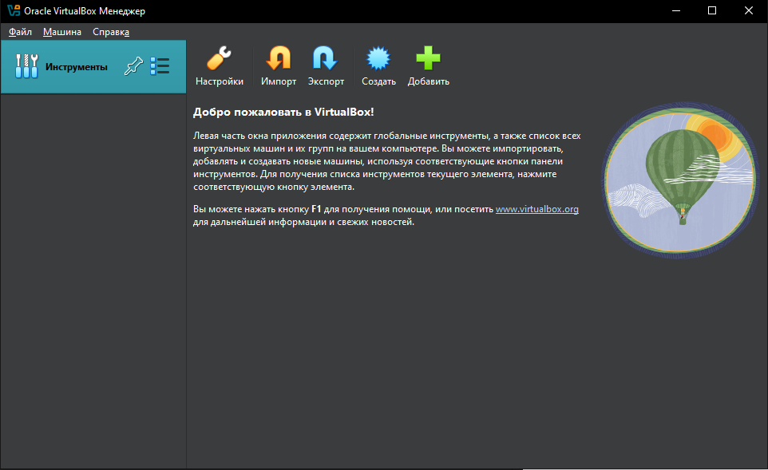
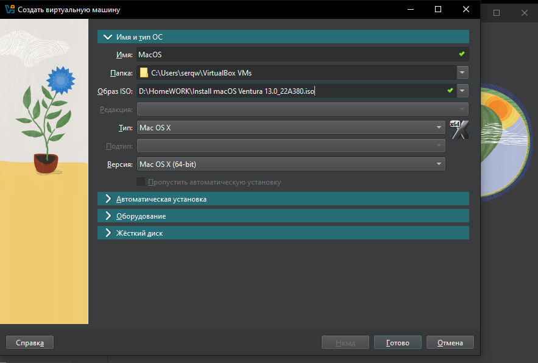
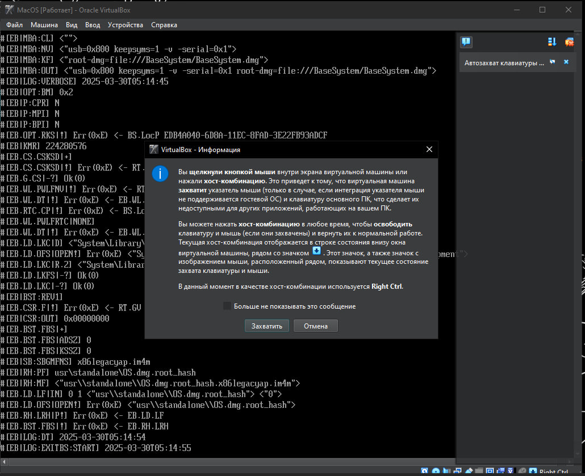
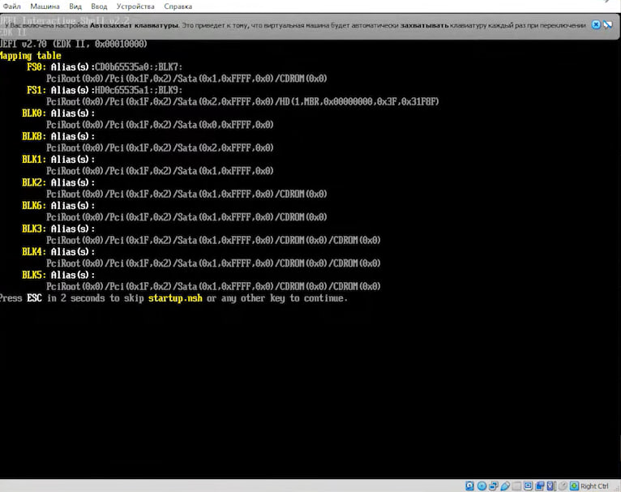
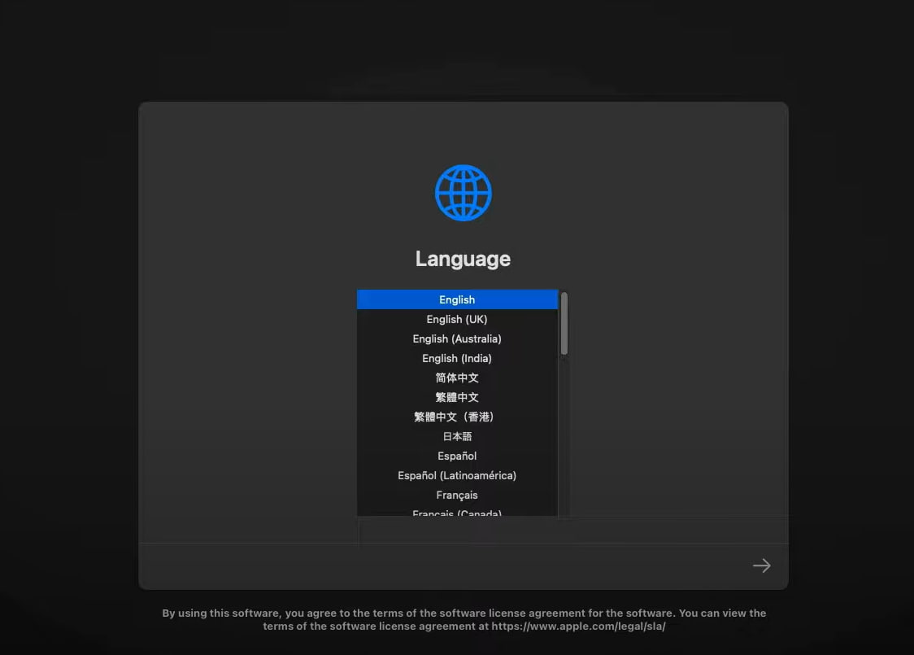
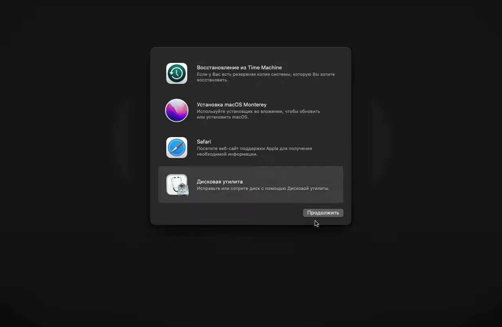
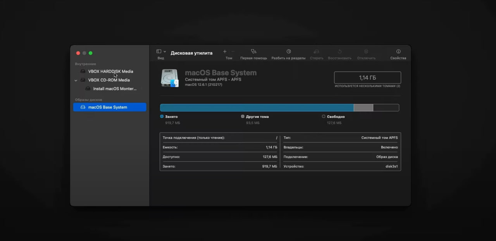
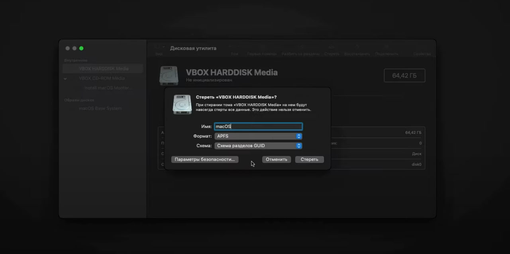
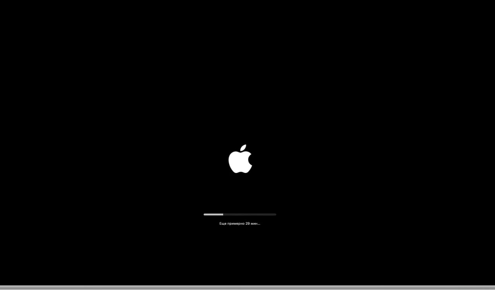
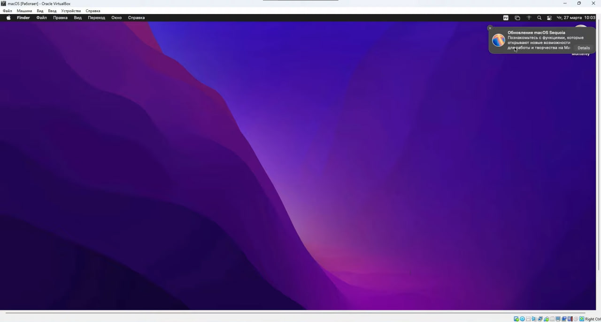

# Отчет по учебной практике: Установка macOS Ventura на виртуальную машину

## Введение
Цель данной практики — ознакомиться с процессом загрузки и установки программного обеспечения на операционной системе macOS Ventura, используя виртуальную машину. В рамках практики была выполнена установка macOS Ventura и настройка необходимого программного обеспечения.

## Задание: Установка macOS Ventura на виртуальную машину

### Подготовка виртуальной машины

**Выбор программного обеспечения для виртуализации:**
   - Для создания виртуальной машины был выбран VirtualBox.
   - 

### Выбор и загрузка установщика

**Загрузка установщика:**
   - Установщик macOS Ventura был загружен из Mac App Store.
   - 

**Создание загрузочного USB-диска:**
   - С помощью Terminal был создан загрузочный USB-диск.
  
   - 

### Процесс установки

**Запуск установки:**
   - Виртуальная машина была запущена, и началась установка macOS Ventura с загрузочного USB-диска.
- 
- 
 
**Установка macOS Ventura:**
   - Следуя инструкциям на экране, была успешно завершена установка операционной системы на виртуальную машину.
      - 
   - 
   - 
   - 
   - 
   - 
   - 
   - 

**Обновление системы:**
   - Система и установленные пакеты были обновлены до последней версии.

## Заключение

Практика по установке macOS Ventura на виртуальную машину была успешно выполнена. Были получены навыки работы с операционной системой macOS в виртуальной среде, установки и настройки программного обеспечения, а также решения возникающих проблем.

