# Практическое задание: Работа с виртуализацией (VirtualBox)

## Цель
Ознакомиться с технологией виртуализации, научиться создавать и настраивать виртуальные машины с помощью VirtualBox, а также установить и настроить различные операционные системы в виртуальной среде.

## Задание 1: Установка VirtualBox и создание виртуальной машины

1. **Установка VirtualBox:**
    - Загрузите и установите последнюю версию VirtualBox на ваш компьютер.
    - Убедитесь, что VirtualBox успешно запускается и функционирует.
    - *Скриншот: Успешный запуск VirtualBox*
      ```markdown
   - 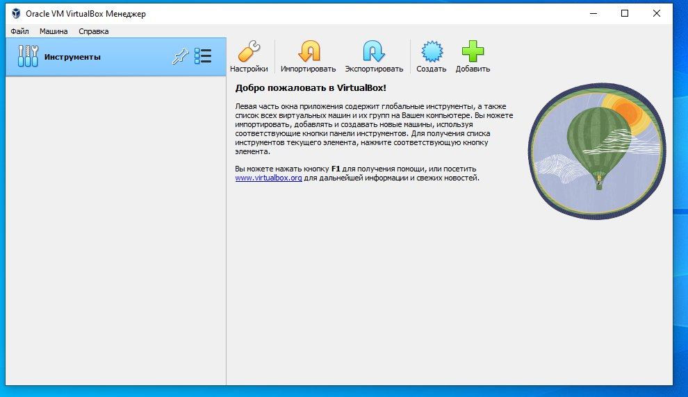
      ```

2. **Создание виртуальной машины:**
    - Создайте новую виртуальную машину для установки операционной системы Mac или Linux (например, Ubuntu).
    - Настройте параметры виртуальной машины: назначьте необходимое количество оперативной памяти и создайте виртуальный жесткий диск.
    - *Скриншот: Создание новой виртуальной машины*
      ```markdown
    -  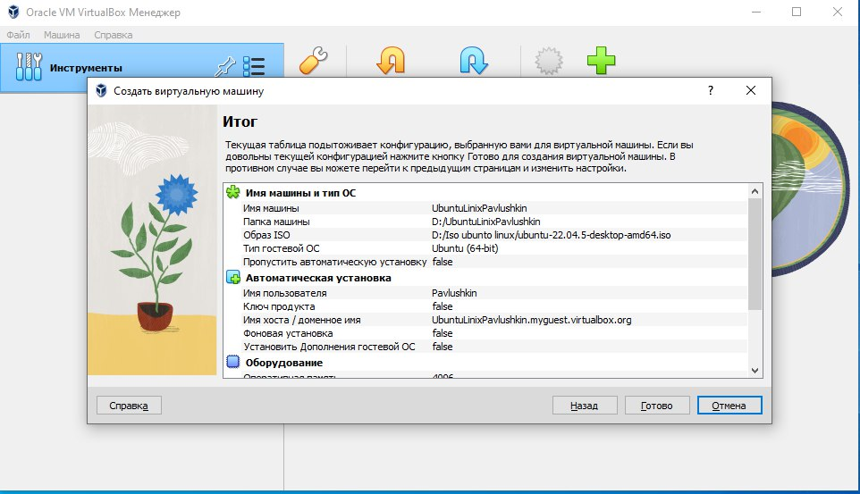
    - 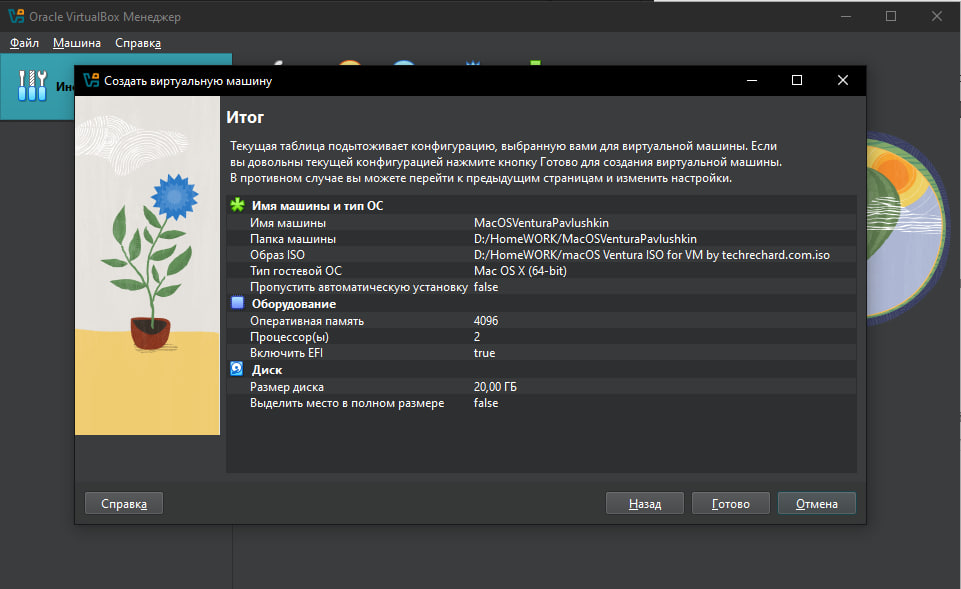
      ```

## Задание 2: Установка операционной системы в виртуальной машине

1. **Установка Mac:**
    - Загрузите образ ISO Mac.
    - Установите Mac в созданной виртуальной машине.
    -
    - Настройте сетевые подключения и подключите интернет.
    - 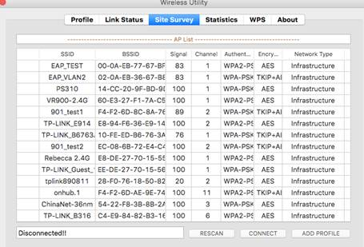
    - 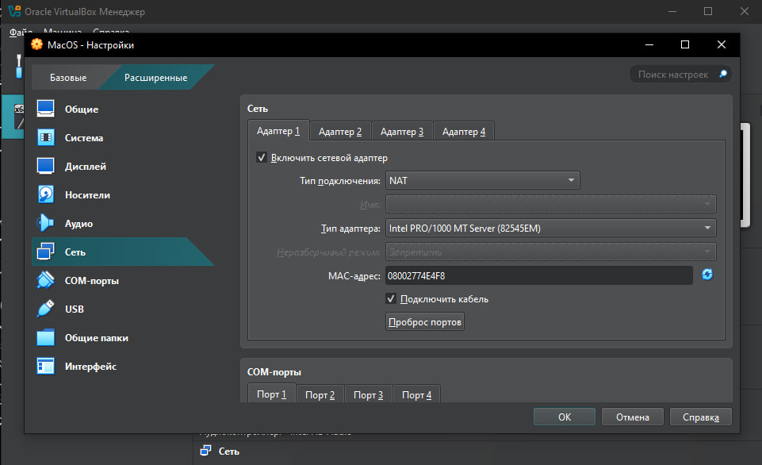
    - *Скриншот: Установка Mac*
  
2. **Установка Linux (Ubuntu):**
    - Загрузите образ ISO Ubuntu.
    - Установите Ubuntu в отдельной виртуальной машине.
     - 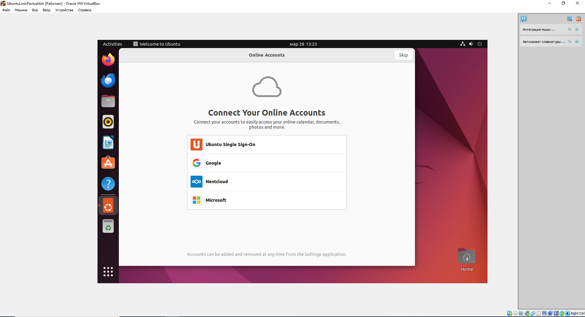
    - Настройте сетевые подключения и подключите интернет.
    - 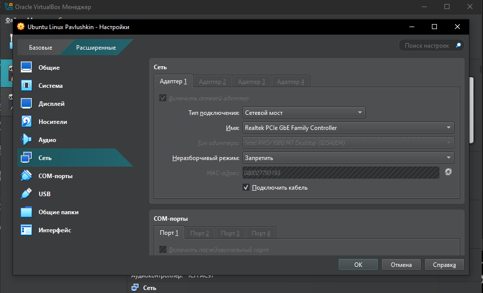
    - *Скриншот: Установка Ubuntu*

## Задание 3: Настройка и сравнение операционных систем

1. **Настройка ОС:**
    - Установите необходимые драйверы и обновления для каждой ОС.
    - Настройте пользовательский интерфейс и базовые настройки системы.
    - *Скриншот: Настройка ОС*
     - 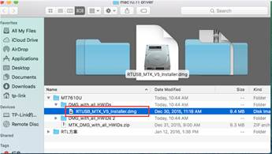
     - 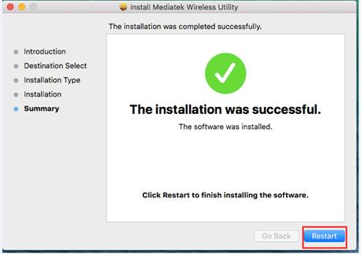
     - 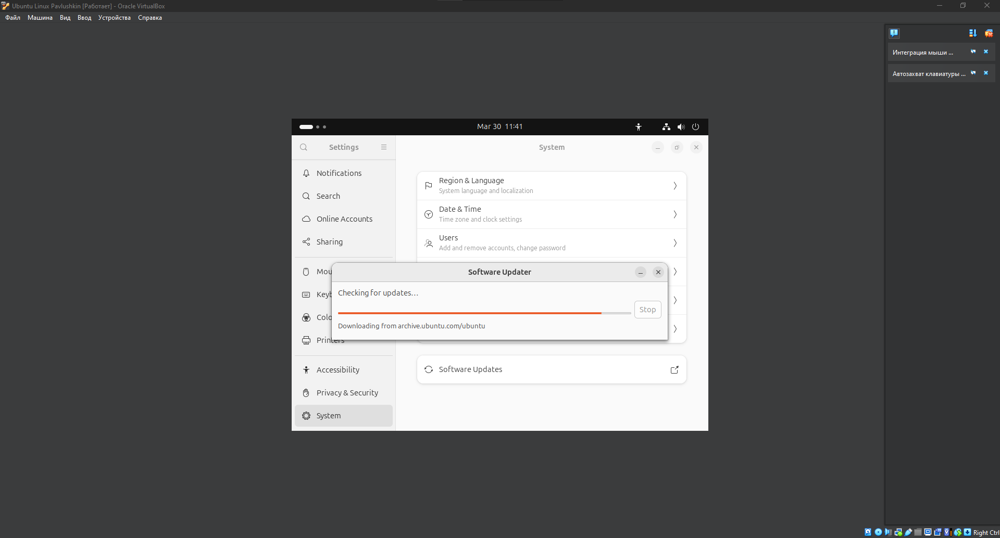
     - 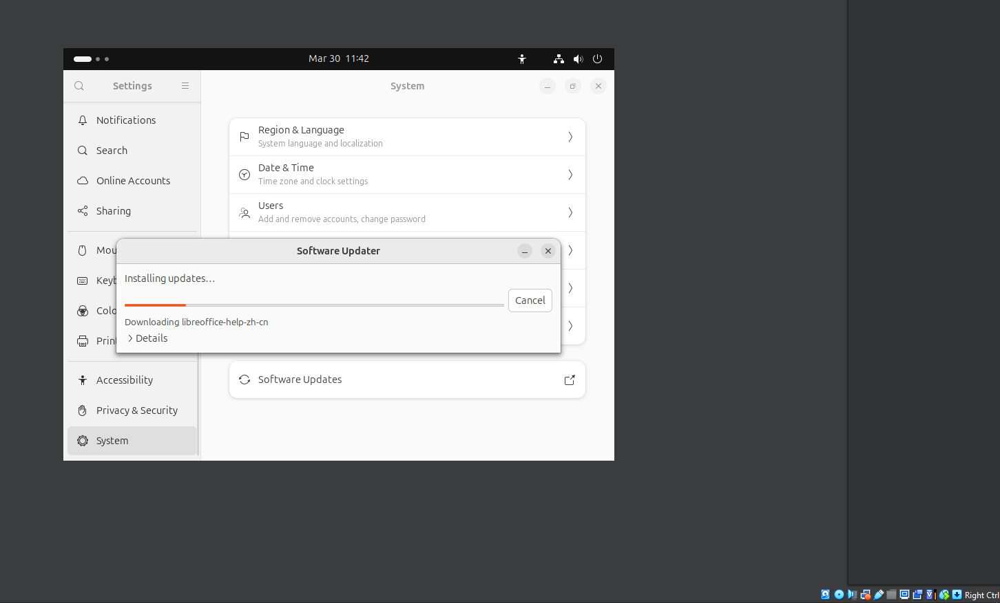


2. **Сравнительный анализ:**
    - Сравните особенности, производительность и удобство использования Mac и Ubuntu в виртуальной среде.
    - Опишите преимущества и недостатки использования виртуальных машин для работы с разными ОС.

## Задание 4: Настройка сетевых подключений в VirtualBox

1. **Настройка NAT:**
    - Создайте виртуальную машину с сетевым адаптером, настроенным на NAT.
    - Проверьте доступ к интернету из виртуальной машины.
    - *Скриншот: Настройка NAT*
      - 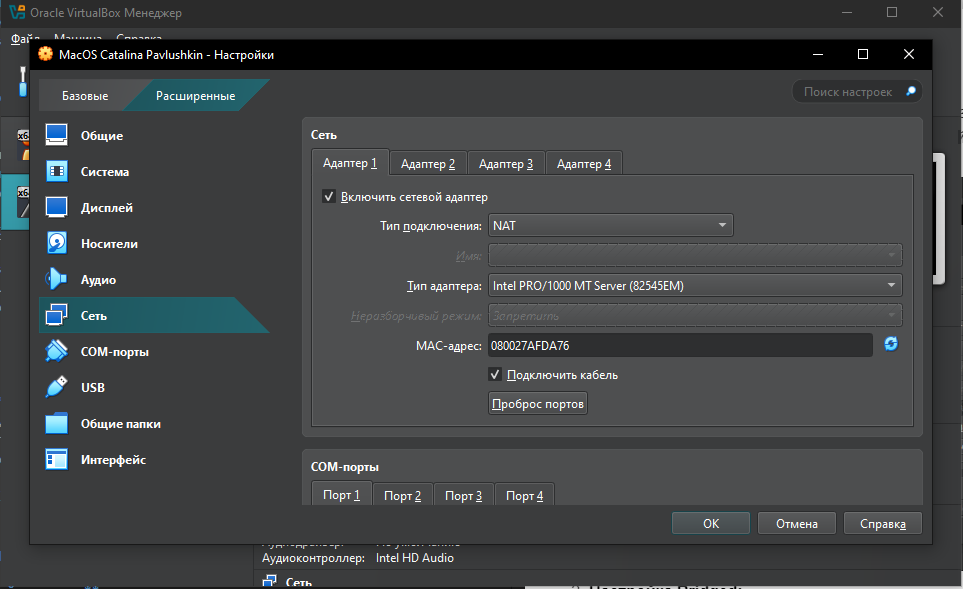
     - 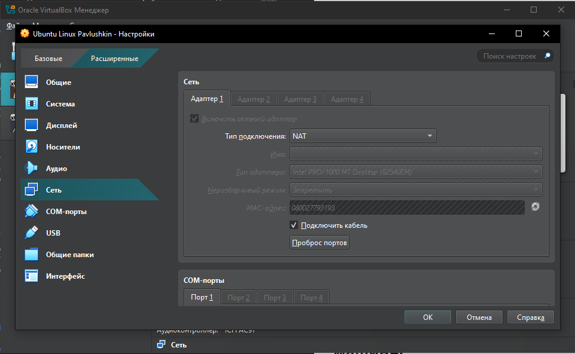
2. **Настройка Bridged:**
    - Измените сетевой адаптер на Bridged.
    - Проверьте доступ к локальной сети и интернету.
    - *Скриншот: Настройка Bridged*
  - 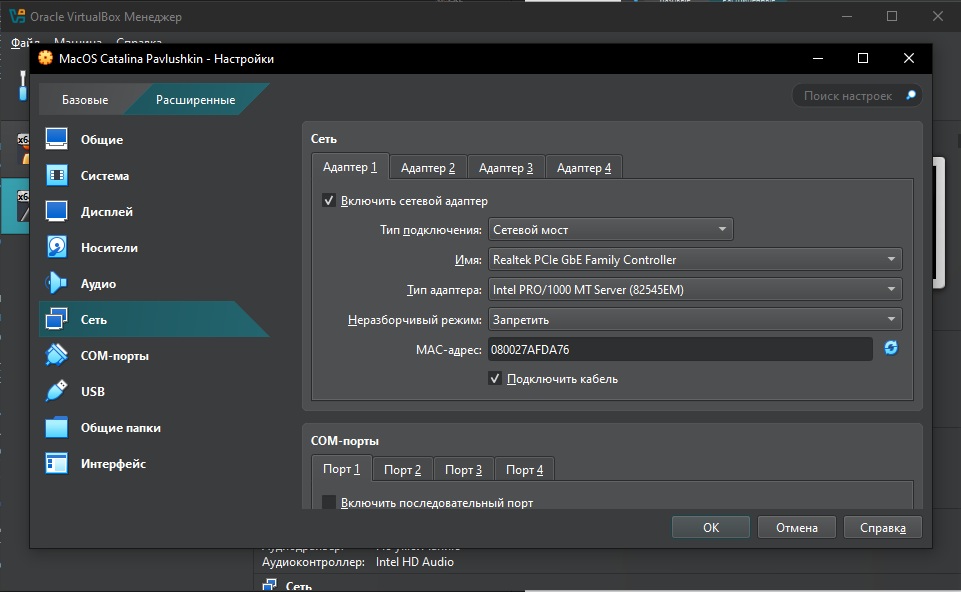
  - 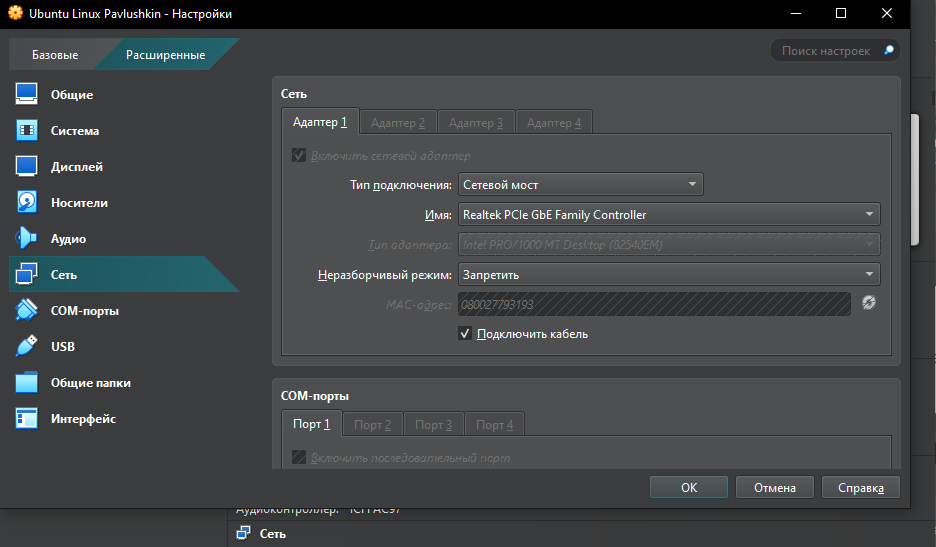

3. **Настройка Host-Only:**
    - Настройте сетевой адаптер на Host-Only.
    - Проверьте возможность обмена данными между хостом и виртуальной машиной.


## Задание 5: Управление ресурсами виртуальной машины

1. **Управление оперативной памятью:**
    - Измените объем оперативной памяти, выделенной виртуальной машине.
    - Проверьте влияние на производительность.
   - 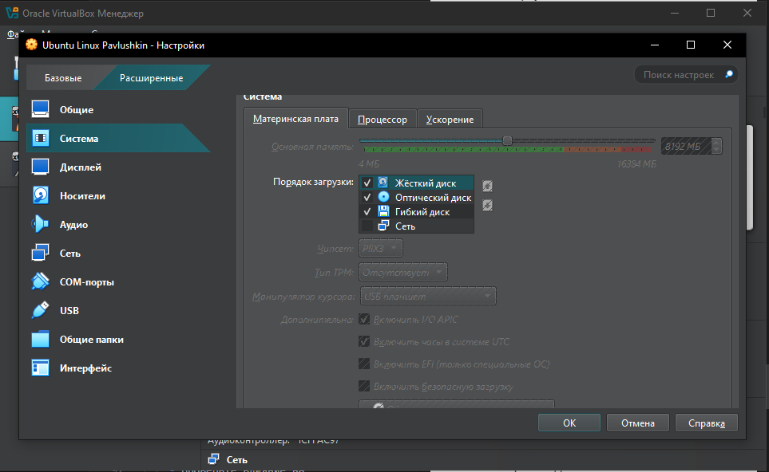
   - 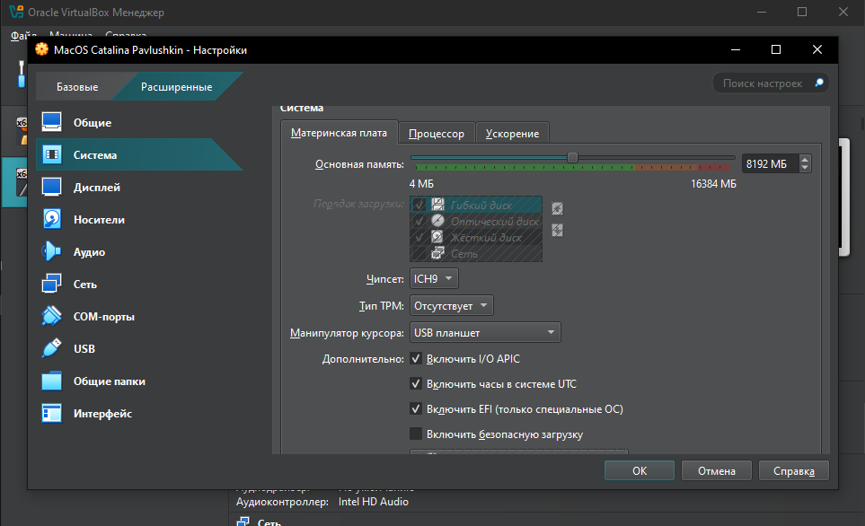
2. **Управление процессорами:**
    - Измените количество ядер процессора, доступных виртуальной машине.
    - Проверьте влияние на производительность.
    - 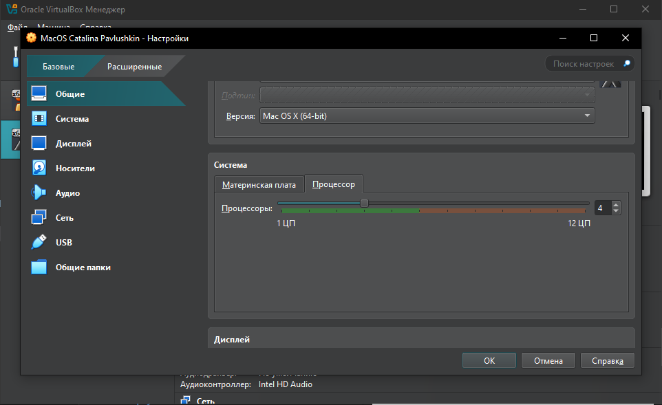
    - 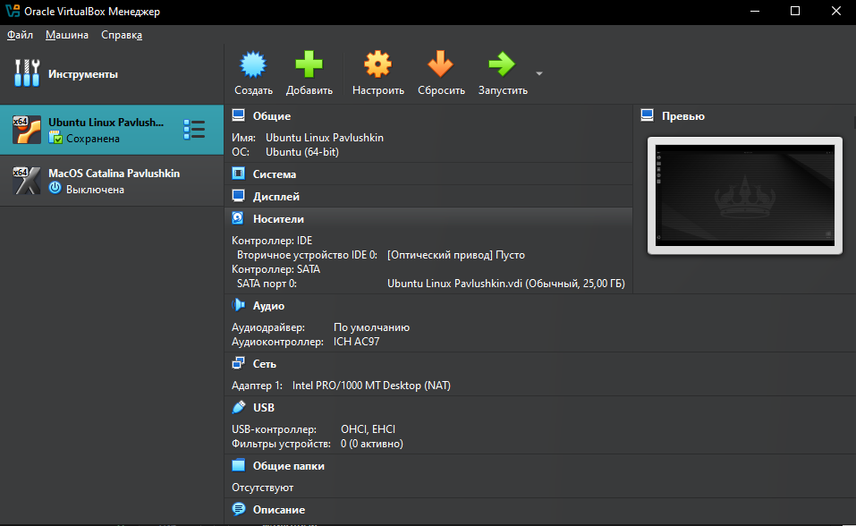

## Задание 6: Использование снимков виртуальных машин

1. **Создание снимка:**
    - Создайте снимок виртуальной машины в определённом состоянии.
    - Проверьте возможность восстановления состояния из снимка.
    - *Скриншот: Создание снимка*
      ```markdown
      
      ```

2. **Восстановление из снимка:**
    - Внесите изменения в виртуальную машину после создания снимка.
    - Восстановите состояние из снимка и проверьте, что изменения были отменены.
    - *Скриншот: Восстановление из снимка*
      ```markdown
      
      ```

## Задание 7: Настройка общего буфера обмена и папок

1. **Настройка общего буфера обмена:**
    - Включите общий буфер обмена между хостом и виртуальной машиной.
    - Проверьте возможность копирования и вставки данных между системами.
    - *Скриншот: Настройка общего буфера обмена*
      ```markdown
      
      ```

2. **Настройка общих папок:**
    - Настройте общую папку между хостом и виртуальной машиной.
    - Проверьте возможность обмена файлами между системами.
    - *Скриншот: Настройка общих папок*
      ```markdown
      
      ```

## Отчетность

- **Отчет:** Напишите подробный отчет о выполнении заданий, включая любые возникшие проблемы и их решения.

## Критерии оценки

- Точность выполнения инструкций.
- Качество отчета и презентации.
- Способность решать проблемы, возникшие во время выполнения заданий.

## Срок сдачи

- 28.03-30.03 – Оценка 5
- 31.03-1.04 – Оценка 4
- 2.04 – Оценка 3
- Позднее – Оценка 2
